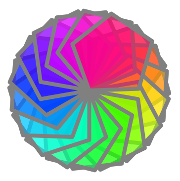
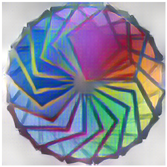
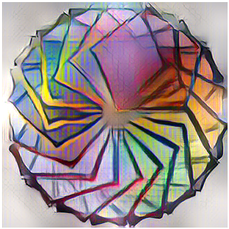

# Kojo-AI
Support for data science, machine learning, and more - within Kojo.

A previous cut of kojo-ai is available at https://github.com/litan/kojo-ai. This is the next cut, based on the official tensorflow-java api

### Current Features (work in progress, but functional):
* Neural Networks (via Tensorflow Java)
* Plotting (via XCharts)
* Graphs (Bfs, Dfs, A* search, etc)
* Neural Style Transfer (NST)

#### NST Example
An example showing NST in action is given below:

```scala
// #include /nst.kojo

cleari()
clearOutput()

val alpha = 0.8f
val fltr1 = new NeuralStyleFilter("/path/to/savedmodel/", "/path/to/style.jpg", alpha)
// val fltr2 = new NeuralStyleFilter("/path/to/savedmodel/", "/path/to/style2.jpg", alpha)

val drawing = Picture {
    setPenColor(cm.gray)
    var clr = cm.rgba(255, 0, 0, 127) // start with a semi transparent red color
    setPenThickness(8)
    repeat(18) {
        setFillColor(clr)
        repeat(5) {
            forward(100)
            right(72)
        }
        clr = clr.spin(360 / 18) // change color hue
        right(360 / 18)
    }
}

val pic = effect(fltr1) -> drawing
// or apply two filters
// val pic = effect(fltr1) * effect(fltr2) -> drawing

draw(pic)
```

#### Example Style Transfer images

**Original Kojo Drawing**:



**Drawing with one NST filter applied**:



**Drawing with two NST filters applied**:



