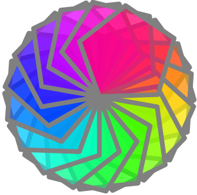

# Kojo-AI
Support for data science, machine learning, and more - within [Kojo](https://www.kogics.net/kojo).

A previous cut of kojo-ai is available at https://github.com/litan/kojo-ai. This is the next cut, based on the official [Tensorflow-Java](https://github.com/tensorflow/java) API.

### Current Features (work in progress, but functional):
* [Neural](doc/linear-regression.md) [Networks](doc/nonlinear-regression.md) (via Tensorflow-Java).
* Plotting (via XCharts).
* [Graphs](https://github.com/litan/kojo-ai-2/blob/master/src/main/kojo/graph-workbench.kojo) (Bfs, Dfs, A* search, etc).
* [Neural Style Transfer](doc/style-transfer.md) (NST) (via Tensorflow-Java and [Arbitrary Style Transfer](https://github.com/emla2805/arbitrary-style-transfer)).
* [Object](doc/object-detection.md) [Detection](doc/object-detection-webcam.md) (via Tensorflow-Java).

### Get Started
To use Kojo-AI within Kojo, just [use a published release](https://github.com/litan/kojo-ai-2/releases), or copy artifacts from this repo into the [Kojo](https://www.kogics.net/kojo) libk directory as per the following steps:  
`sbt buildDist`  
`mv ~/.kojo/lite/libk ~/.kojo/lite/libk.bak`  
`cp -var dist ~/.kojo/lite/libk`

### NST Example
An example showing NST in action is given below:

```scala
// #include /nst.kojo

cleari()
clearOutput()

val alpha = 0.8f
val fltr1 = new NeuralStyleFilter("/path/to/savedmodel/", "/path/to/style.jpg", alpha)
// val fltr2 = new NeuralStyleFilter("/path/to/savedmodel/", "/path/to/style2.jpg", alpha)

val drawing = Picture {
    setPenColor(cm.gray)
    var clr = cm.rgba(255, 0, 0, 127) // start with a semi transparent red color
    setPenThickness(8)
    repeat(18) {
        setFillColor(clr)
        repeat(5) {
            forward(100)
            right(72)
        }
        clr = clr.spin(360 / 18) // change color hue
        right(360 / 18)
    }
}

val pic = effect(fltr1) -> drawing
// or apply two filters
// val pic = effect(fltr1) * effect(fltr2) -> drawing

draw(pic)
```

#### NST sample images

**Original Kojo Drawing**:



**Drawing with one NST filter applied**:


**Drawing with two NST filters applied**:


