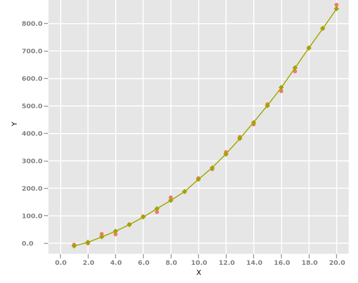

### Nonlinear Regression

Pre-requisites for running the example:
* [Download and install](https://www.kogics.net/kojo-download) Kojo
* Extract the kojo-ai libk directory for your platform under `~/kojo/lite` as explained in the [release notes](https://github.com/litan/kojo-ai-2/releases/tag/v0.3) for v0.3

After that, just run the example code below in Kojo.

### Sample Output



### Code

```
// #include /nn.kojo
// #include /plot.kojo

cleari()
clearOutput()

val a = 2
val b = 3
val c = 1

val xData0 = Array.tabulate(20)(e => (e + 1).toDouble)
val yData0 = xData0 map (x => a * x * x + b * x + c + random(-15, 15))

val xNormalizer = new StandardScaler()
val yNormalizer = new StandardScaler()

val xData = xNormalizer.fitTransform(xData0)
val yData = yNormalizer.fitTransform(yData0)

val chart = scatterChart("Regression Data", "X", "Y", xData0, yData0)
chart.getStyler.setLegendVisible(true)
drawChart(chart)

val xDataf = xData.map(_.toFloat)
val yDataf = yData.map(_.toFloat)

val model = new NonlinearModel
model.train(xDataf, yDataf)
val yPreds = model.predict(xDataf)
val yPreds0 = yNormalizer.inverseTransform(yPreds.map(_.toDouble))
addLineToChart(chart, Some("model"), xData0, yPreds0)
drawChart(chart)
model.close()

class NonlinearModel {
    val LEARNING_RATE: Float = 0.1f
    val WEIGHT_VARIABLE_NAME: String = "weight"
    val BIAS_VARIABLE_NAME: String = "bias"

    val graph = new Graph
    val tf = Ops.create(graph)
    val session = new Session(graph)

    def randomw(a: Int, b: Int) = tf.math.mul(tf.random.truncatedNormal(tf.array(a, b), classOf[TFloat32], TruncatedNormal.seed(100)), tf.constant(0.1f))

    // Define variables
    val weight = tf.withName(WEIGHT_VARIABLE_NAME).variable(randomw(1, 50))
    val bias = tf.withName(BIAS_VARIABLE_NAME).variable(Shape.of(50), classOf[TFloat32])
    tf.initAdd(tf.assign(bias, tf.zerosLike(bias)))

    val weight2 = tf.withName(WEIGHT_VARIABLE_NAME + "2").variable(randomw(50, 8))
    val bias2 = tf.withName(BIAS_VARIABLE_NAME + "2").variable(Shape.of(8), classOf[TFloat32])
    tf.initAdd(tf.assign(bias2, tf.zerosLike(bias2)))

    val weight3 = tf.withName(WEIGHT_VARIABLE_NAME + "3").variable(randomw(8, 1))
    val bias3 = tf.withName(BIAS_VARIABLE_NAME + "3").variable(Shape.of(1), classOf[TFloat32])
    tf.initAdd(tf.assign(bias3, tf.zerosLike(bias3)))

    tf.init()

    def placeholders = {
        // Define placeholders
        val xData = tf.placeholder(classOf[TFloat32], Placeholder.shape(Shape.of(-1, 1)))
        val yData = tf.placeholder(classOf[TFloat32], Placeholder.shape(Shape.of(-1, 1)))
        (xData, yData)
    }

    def modelFunction(xData: Placeholder[TFloat32], yData: Placeholder[TFloat32]) = {
        // Define the model function
        val mul = tf.linalg.matMul(xData, weight)
        val add = tf.math.add(mul, bias)
        val output1 = tf.nn.relu(add)

        val mul2 = tf.linalg.matMul(output1, weight2)
        val add2 = tf.math.add(mul2, bias2)
        val output2 = tf.nn.relu(add2)

        val mul3 = tf.linalg.matMul(output2, weight3)
        tf.math.add(mul3, bias3)
    }

    def train(xValues: Array[Float], yValues: Array[Float]): Unit = {
        val N = xValues.length

        val (xData, yData) = placeholders
        val yPredicted = modelFunction(xData, yData)

        // Define loss function MSE
        val sum = tf.math.pow(tf.math.sub(yPredicted, yData), tf.constant(2f))
        val mse = tf.math.div(sum, tf.constant(2f * N))

        // Back-propagate gradients to variables for training
        val optimizer = new GradientDescent(graph, LEARNING_RATE)
        val minimize = optimizer.minimize(mse)

        // Initialize graph variables
        session.run(tf.init)

        // Train the model on data
        for (epoch <- 1 to 1500) {
            val xTensor = TFloat32.tensorOf(Shape.of(N, 1), DataBuffers.of(xValues, true, false))
            val yTensor = TFloat32.tensorOf(Shape.of(N, 1), DataBuffers.of(yValues, true, false))
            session.runner.addTarget(minimize).feed(xData.asOutput, xTensor).feed(yData.asOutput, yTensor).run
            xTensor.close(); yTensor.close()
        }
    }

    def predict(xValues: Array[Float]): Array[Float] = {
        val (xData, yData) = placeholders
        val yPredicted = modelFunction(xData, yData)

        val xTensor = TFloat32.tensorOf(Shape.of(xValues.length, 1), DataBuffers.of(xValues, true, false))
        val yPredictedTensor = session.runner.feed(xData.asOutput, xTensor).fetch(yPredicted).run.get(0).asInstanceOf[TFloat32]
        val predictedY = new Array[Float](xValues.length)
        val predictedYBuffer = yPredictedTensor.asRawTensor().data().asFloats()
        predictedYBuffer.read(predictedY)
        xTensor.close(); yPredictedTensor.close()
        predictedY
    }

    def close() {
        session.close()
        graph.close()
    }
}
```
