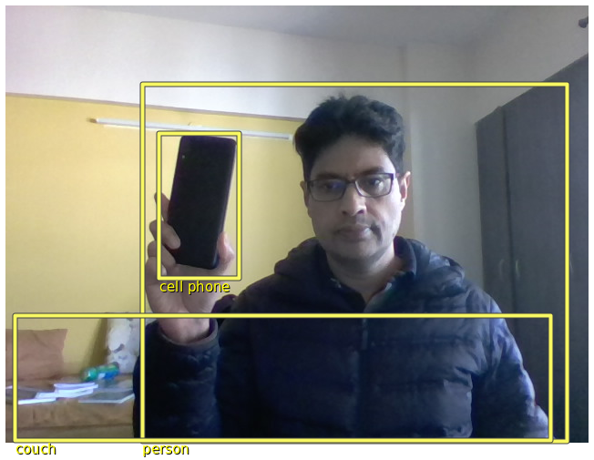

### Object Detection via Webcam

Pre-requisites for running the example:
* [Download and install](https://www.kogics.net/kojo-download) Kojo
* Extract the kojo-ai libk directory for your platform under `~/kojo/lite` as explained in the [release notes](https://github.com/litan/kojo-ai-2/releases/tag/v0.2) for v0.2. This will *install* kojo-ai for you inside Kojo.
* Clone (or download/extract) this repo (this will give you easy access to the [images](../images) required by some of the examples).
* Download and extract the [saved model](https://github.com/litan/kojo-ai-2/releases/download/v0.2/object_detection_saved_model.zip) for this example.

After that, just run the example code below in Kojo.

### Sample Output



### Code

```
import java.awt.image.BufferedImage
import java.util
import org.tensorflow.Tensor
import org.tensorflow.ndarray.Shape
import org.tensorflow.ndarray.buffer.DataBuffers
import org.tensorflow.types.TFloat32
import org.tensorflow.types.TUint8
import com.github.sarxos.webcam.Webcam
import org.tensorflow.SavedModelBundle
import net.kogics.kojo.tensorutil._

// you need to change the following locations based on where you downloaded and extracted
// the kojo-ai repository and the object detection saved-model
val kojoAiRoot = "/home/lalit/work/kojo-ai-2"
val savedModel = "/home/lalit/work/object-det/models/ssdlite_mobilenet_v2_coco_2018_05_09/saved_model"

val fps = 5
cleari()
val cb = canvasBounds
val webcam = Webcam.getDefault()
println(webcam)
val views = webcam.getViewSizes
val idx = views.length - 1
val selectedView = views(idx)
webcam.setViewSize(selectedView)
webcam.open()

zoom(1, selectedView.getWidth / 2, selectedView.getHeight / 2)

var stop = false
val stopBtn = picStackCentered(
    fillColor(red) -> Picture.rectangle(100, 50),
    penColor(black) -> Picture.text("Stop")
)
stopBtn.onMouseClick { (x, y) =>
    stop = true
}
stopBtn.setPosition(-110, -60)
draw(stopBtn)

var pics = ArrayBuffer.empty[Picture]

val model = SavedModelBundle.load(savedModel)

val labelsFile = scala.io.Source.fromFile(s"$kojoAiRoot/src/main/kojo/mscoco-labels.txt")
val labels = HashMap.empty[Int, String]
labelsFile.getLines.zipWithIndex.foreach {
    case (line, idx) =>
        labels.put(idx + 1, line.trim)
}
labelsFile.close()

try {
    val delay = 1.0 / fps
    repeatWhile(!stop) {
        // get image
        val frame = webcam.getImage();
        val pics2 = detectAndDraw(frame)
        pics.foreach { pic =>
            pic.erase()
        }
        pics = pics2
        pause(delay)
    }
}
finally {
    webcam.close()
    model.close()
}

case class DetectionOutput(boxes: Tensor[TFloat32], scores: Tensor[TFloat32], classes: Tensor[TFloat32], num: Tensor[TFloat32])

def drawBox(src: BufferedImage, box: ArrayBuffer[Float], label: String, pics2: ArrayBuffer[Picture]) {
    val w = src.getWidth
    val h = src.getHeight
    val xmin = w * box(1)
    val xmax = w * box(3)
    val ymin1 = h * box(0)
    val ymax = h - ymin1
    val ymax1 = h * box(2)
    val ymin = h - ymax1
    //    println(xmin, xmax, ymin, ymax)
    //    println(box)
    val bbox = Picture.rectangle(xmax - xmin, ymax - ymin)
    val bbox2 = Picture.rectangle(xmax - xmin, ymax - ymin)
    val lbl = Picture.text(label)
    val lbl2 = Picture.text(label)
    draw(bbox2, bbox, lbl2, lbl)
    bbox.setPosition(xmin, ymin)
    bbox2.setPosition(xmin, ymin)
    bbox.setPenColor(ColorMaker.hsl(60, 0.91, 0.68))
    bbox2.setPenColor(darkGray)
    bbox.setPenThickness(4)
    bbox2.setPenThickness(6)
    lbl.setPosition(xmin, ymin)
    lbl.setPenColor(yellow)
    lbl2.setPosition(xmin + 1, ymin - 1)
    lbl2.setPenColor(black)
    pics2.append(bbox2, bbox, lbl2, lbl)
}

def drawBoxes(detectionOutput: DetectionOutput, src: BufferedImage, pics2: ArrayBuffer[Picture]) {
    val num = detectionOutput.num.data.getFloat().toInt
    //    println(s"Objects detected: $num")
    //    println(detectionOutput)
    for (i <- 0 until detectionOutput.boxes.shape.size(1).toInt) {
        val score = detectionOutput.scores.data.getFloat(0, i)
        if (score > 0.3) {
            //            println(score)
            val box = ArrayBuffer.empty[Float]
            detectionOutput.boxes.data.get(0, i).scalars.forEach { x =>
                box.append(x.getFloat())
            }
            val code = detectionOutput.classes.data.getFloat(0, i).toInt
            val label = labels.getOrElse(code, s"Unknown code - $code")
            drawBox(src, box, label, pics2)
        }
    }
}

def detectAndDraw(src: BufferedImage): ArrayBuffer[Picture] = {
    val pics2 = ArrayBuffer.empty[Picture]
    val args = new util.HashMap[String, Tensor[_]]()
    val inputTensor = imgToTensorI(src)
    args.put("inputs", inputTensor)
    val out = model.call(args)
    val boxes = out.get("detection_boxes").asInstanceOf[Tensor[TFloat32]]
    val classes = out.get("detection_classes").asInstanceOf[Tensor[TFloat32]]
    val scores = out.get("detection_scores").asInstanceOf[Tensor[TFloat32]]
    val num = out.get("num_detections").asInstanceOf[Tensor[TFloat32]]

    val detection = DetectionOutput(boxes, scores, classes, num)
    val pic = Picture.image(src)
    pics2.append(pic)
    draw(pic)
    drawBoxes(detection, src, pics2)
    pics2
}
```
