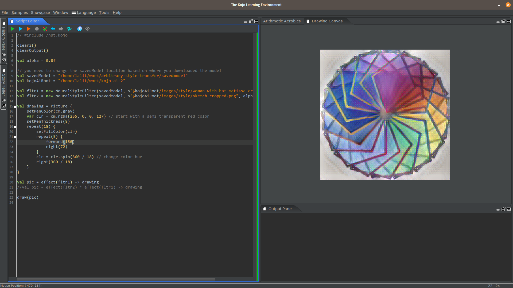

### Style Transfer

Pre-requisites for running the example:
* [Download and install](https://www.kogics.net/kojo-download) Kojo.
* Extract the kojo-ai libk directory for your platform under `~/kojo/lite` as explained in the [release notes](https://github.com/litan/kojo-ai-2/releases/tag/v0.2) for v0.2. This will *install* kojo-ai for you inside Kojo.
* Clone (or download/extract) this repo (this will give you easy access to the [images](../images) required by some of the examples).
* Download and extract the [saved model](https://github.com/litan/kojo-ai-2/releases/download/v0.1/savedmodel.zip) for this example.

After that, just run the example code below (at the bottom of this page) in Kojo.

### Original Drawing, Style Image, and Final Output


### Kojo Screenshot



### Code

```
// #include /nst.kojo

cleari()
clearOutput()
setBackground(white)

val alpha = 0.8f

// you need to change the following locations based on where you downloaded and extracted 
// the kojo-ai repository and the style transfer saved-model
val kojoAiRoot = "/home/lalit/work/kojo-ai-2"
val savedModel = "/home/lalit/work/arbitrary-style-transfer/savedmodel"

val fltr1 = new NeuralStyleFilter(savedModel, s"$kojoAiRoot/images/style/woman_with_hat_matisse_cropped.jpg", alpha)
val fltr2 = new NeuralStyleFilter(savedModel, s"$kojoAiRoot/images/style/sketch_cropped.png", alpha)

val drawing = Picture {
    setPenColor(cm.gray)
    var clr = cm.rgba(255, 0, 0, 127) // start with a semi transparent red color
    setPenThickness(8)
    repeat(18) {
        setFillColor(clr)
        repeat(5) {
            forward(100)
            right(72)
        }
        clr = clr.spin(360 / 18) // change color hue
        right(360 / 18)
    }
}

val pic = effect(fltr1) -> drawing
//val pic = effect(fltr2) * effect(fltr1) -> drawing

draw(pic)
```
